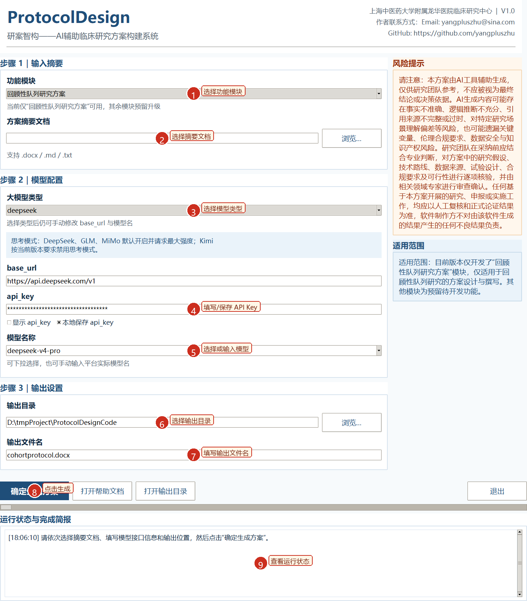

# ProtocolDesign

> 面向中文医学研究场景的 Windows 桌面工具，用于将研究摘要自动扩写为结构完整、格式规范的回顾性队列研究方案 DOCX 文档。

ProtocolDesign 聚焦临床科研与医学文本规范化写作，当前版本支持将研究团队提供的方案摘要输入到桌面应用中，经由 OpenAI 兼容大模型接口生成完整研究方案，并输出可继续审阅与修改的 Word 文档。



## 为什么使用 ProtocolDesign

- **面向真实研究写作场景**：输出为可直接审阅和继续编辑的 `.docx` 文档，而不是仅供复制的纯文本。
- **保留研究方案结构**：自动生成封面、目录、结构化摘要表、正文各章节及附表。
- **兼容多家模型接口**：支持 DeepSeek、Kimi、GLM、MiMo 以及自定义 OpenAI 兼容服务。
- **更适合中文医学写作**：内置章节写作规则、提示词资源和方案模板约束。
- **桌面端可直接交付**：支持打包为 `ProtocolDesign.exe`，便于研究团队在 Windows 环境中分发使用。
- **API Key 本地加密保存**：可选使用 Windows DPAPI 加密保存密钥，不以明文写入配置。

## 当前能力

当前仅正式支持：

- `回顾性队列研究方案`

界面中展示的其他模块为后续升级预留，当前版本不会用于正式生成。

## 生成结果

生成成功后，软件会在目标目录输出：

- 完整研究方案 `.docx`
- 同名 `_运行简报.txt`

如果生成失败，程序目录会额外写出：

- `ProtocolDesign_error.log`

## 快速开始

### 环境要求

- Windows 10 / 11
- Python 3.11+
- 可访问 OpenAI 兼容 `chat/completions` 接口的大模型服务
- LibreOffice（可选，仅用于生成帮助文档 PDF）

### 安装依赖

```powershell
python -m pip install -r requirements.txt
```

### 从源码运行

```powershell
python src/ProtocolDesign.py
```

### 构建发布版

```powershell
.\build_windows.ps1
```

构建完成后，发布产物会输出到 `APP/` 目录。

## 使用流程

1. 启动 `ProtocolDesign.exe` 或运行源码版本。
2. 选择功能模块：当前请选择 `回顾性队列研究方案`。
3. 导入方案摘要文件，支持 `.docx`、`.md`、`.txt`。
4. 配置模型提供商、`base_url`、`api_key` 和模型名称。
5. 选择输出目录并填写输出文件名。
6. 点击“确定生成方案”，等待模型生成和 DOCX 渲染完成。

## 项目结构

```text
ProtocolDesignCode/
├─ src/
│  ├─ ProtocolDesign.py          # 主程序：UI、模型调用、JSON 修复与生成流程
│  ├─ protocol_renderer.py       # DOCX 渲染器
│  ├─ build_help_docx.py         # 帮助文档生成脚本
│  ├─ resource_crypto.py         # 打包后资源解密加载
│  └─ encrypt_resources.py       # 构建时资源加密
├─ resources/                    # 提示词资源、写作指南、模板资产
├─ docs/                         # Markdown 帮助文档
├─ help_assets/                  # README / 帮助文档截图资源
├─ samples/                      # 示例摘要文件
├─ APP/                          # 打包输出目录
├─ build_windows.ps1             # Windows 一键打包脚本
└─ requirements.txt
```

## 文档

- 使用帮助：[`docs/ProtocolDesign_帮助文档.md`](docs/ProtocolDesign_帮助文档.md)
- 贡献指南：[`CONTRIBUTING.md`](CONTRIBUTING.md)
- 发布说明：[`CHANGELOG.md`](CHANGELOG.md)

## 开发说明

### 常用命令

```powershell
python -m py_compile src/ProtocolDesign.py src/protocol_renderer.py src/build_help_docx.py src/resource_crypto.py src/encrypt_resources.py
python src/build_help_docx.py
python src/encrypt_resources.py
```

### 关键实现概览

```text
研究摘要文件
  → 读取文本
  → 拼接提示词（技能规则 + 写作指南 + 用户摘要）
  → 调用大模型接口生成 JSON
  → 修复常见 JSON 格式问题
  → 校验结构完整性
  → 渲染为 DOCX 研究方案
  → 写出运行简报
```

## 风险提示

本软件生成内容由 AI 辅助完成，仅供研究团队参考，不应直接视为最终研究结论、正式申报文本或临床/科研决策依据。使用前请务必结合专业判断，对研究设计、变量定义、统计分析、伦理与数据安全要求进行人工复核。

## 许可证

本项目采用 [`GPL-3.0`](LICENSE) 许可证发布。

## 联系方式

- 软件制作方：上海中医药大学附属龙华医院临床研究中心
- 作者邮箱：yangpluszhu@sina.com
- 作者 GitHub：<https://github.com/yangpluszhu>
